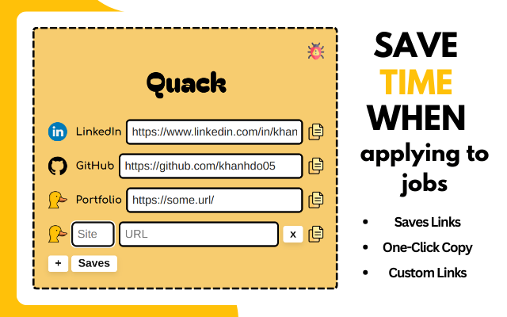
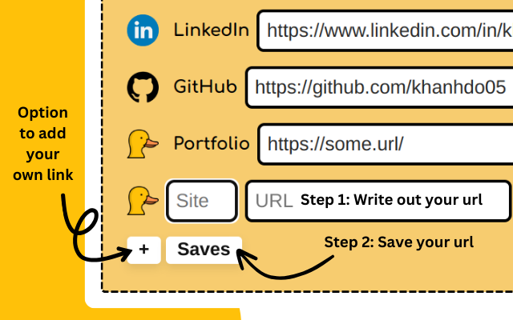
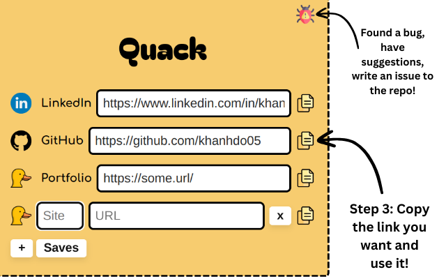

# Quack

Quickly copy-paste GitHub, LinkedIn, and portfolio links for job applications using Quack.

## Installation

To install the extension, visit the [Chrome Web Store](https://chromewebstore.google.com/detail/quack/kbbkbaoiaeccjdbkcjngdfgphfeolcfj) and click "Add to Chrome".



## Usage




## Contributing

We welcome contributions from the community! Here are some guidelines to help you get started:

### Reporting Bugs

If you find a bug, please report it by opening an issue on the [GitHub repository](https://github.com/khanhdo05/quack/issues). Include as much detail as possible, such as steps to reproduce the bug, your operating system, and browser version.

### Feature Requests

If you have an idea for a new feature, please open an issue on the [GitHub repository](https://github.com/khanhdo05/quack/issues) and describe your idea in detail. We appreciate all suggestions and feedback!

### Code Contributions

1. **Fork the repository**: Click the "Fork" button at the top right corner of the repository page.
2. **Clone your fork**: 
    ```sh
    git clone git@github.com:khanhdo05/quack.git
    cd quack
    ```
3. **Create a new branch**: 
    ```sh
    git checkout -b feature-or-bugfix-name
    ```
4. **Make your changes**: Implement your feature or bug fix.
5. **Commit your changes**: 
    ```sh
    git add .
    git commit -m "Description of your changes"
    ```
6. **Push to your fork**: 
    ```sh
    git push origin feature-or-bugfix-name
    ```
7. **Create a pull request**: Go to the original repository and click the "New pull request" button. Provide a detailed description of your changes.

### Code Style

Please follow these guidelines to maintain a consistent code style:

- Use 2 spaces for indentation.
- Use camelCase for variable and function names.
- Use descriptive names for variables and functions.
- Add comments to explain complex logic.

### Testing

Before submitting your changes, make sure to test your code thoroughly. You can try out your local version by following these steps:

1. Open Chrome and navigate to `chrome://extensions/`.
2. Enable "Developer mode" by toggling the switch in the top right corner.
3. Click on "Load unpacked" and select the repository folder.

## License

This project is licensed under the MIT License - see the [LICENSE](LICENSE) file for details.

## Contact

If you have any questions or need further assistance, feel free to open an issue on the [GitHub repository](https://github.com/khanhdo05/quack/issues).

---

Thank you for contributing to Quack!